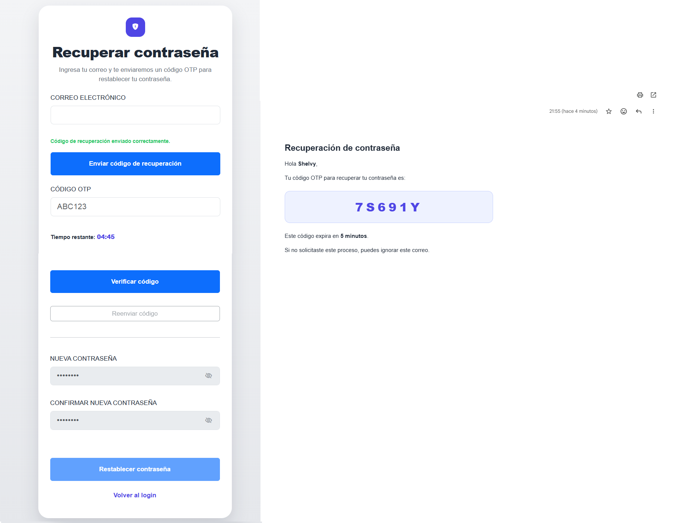

# SistemaDeRegistro

Sistema web de registro e inicio de sesión desarrollado con **Node.js**, **Express**, **PostgreSQL**, **HTML**, **CSS**, **JavaScript** y **Bootstrap**.

El proyecto implementa:

- Registro de usuarios
- Verificación por código OTP enviado por correo Gmail
- Inicio de sesión
- Recuperación de contraseña por OTP
- Validación de formularios
- Manejo de sesiones
- Protección básica contra abusos e intentos excesivos

---

## Tecnologías utilizadas

### Backend
- Node.js
- Express
- PostgreSQL
- Nodemailer
- bcryptjs
- express-session
- connect-pg-simple
- express-validator
- express-rate-limit
- helmet

### Frontend
- HTML5
- CSS3
- JavaScript
- Bootstrap 5
- Bootstrap Icons

### Base de datos
- PostgreSQL en Docker

---

## Estructura del proyecto

```bash
SistemaDeRegistro/
│
├── DB_SistemaDeRegistro/
│   ├── .env
│   ├── docker-compose.yml
│   └── init/
│       └── 01_init.sql
│
├── docs/
│   └── img/
│
├── src/
│   ├── config/
│   ├── controllers/
│   ├── middlewares/
│   ├── models/
│   ├── public/
│   │   ├── css/
│   │   └── js/
│   ├── routes/
│   ├── services/
│   ├── views/
│   ├── app.js
│   └── server.js
│
├── .env
├── .gitignore
├── package.json
└── README.md

```
---

## Características principales
- Registro de usuario con:
    - nombre completo
    - correo electrónico
    - contraseña
- Indicador visual de fortaleza de contraseña
- Aceptación de términos de servicio y política de privacidad
- Envío de código OTP de 6 caracteres al correo
- Verificación de cuenta con tiempo límite de 5 minutos
- Reenvío de OTP
- Inicio de sesión para usuarios verificados
- Recuperación de contraseña mediante OTP
- Restablecimiento de contraseña después de verificar OTP
- Manejo de sesión en PostgreSQL

---
## Requisitos previos

1. Node.js
2. npm
3. Docker Desktop
4. Git

---

## Configuracion de DB

1. Ingresar a la carpeta de DB
```text
cd DB_SistemaDeRegistro
```

2. Configurar el .env
```text
POSTGRES_DB=sistema_de_registro_db
POSTGRES_USER=postgres
POSTGRES_PASSWORD=Admin123
POSTGRES_PORT=5432
```
3. Levantar el contenedor PostgreSQL
```text
docker compose up -d
```
## Instalar dependencias
1. Instalar dependencias
```text
npm install
```
2. Configurar el archivo .env
```bash
PORT=3000
NODE_ENV=development

DB_HOST=localhost
DB_PORT=5432
DB_NAME=sistema_de_registro_db
DB_USER=postgres
DB_PASSWORD=Admin123

SESSION_SECRET=mi_clave_super_secreta_123456

SMTP_HOST=smtp.gmail.com
SMTP_PORT=465
SMTP_SECURE=true
SMTP_USER=tu_correo@gmail.com
SMTP_PASS=tu_app_password
MAIL_FROM="Sistema de Registro <tu_correo@gmail.com>"
```
3. Ejecutar el Proyecto

```bash
npm run dev
```
4. Abrir en el navegador

```text
http://localhost:3000/register
```

## PRUEBAS

**1. Pantalla Registro de Usuarios**
<br>


**2. Pantalla Loguin**
<br>


**3. Pantalla Recuperar Contraseña**
<br>


## Flujo funcional del sistema


---

## Autor
**SHELVY CARRASCO ORÉ**
- GitHub: [@scarrascoore](https://github.com/scarrascoore)
- LinkedIn: [Shelvycarrascoore](https://linkedin.com/in/shelvycarrascoore)


